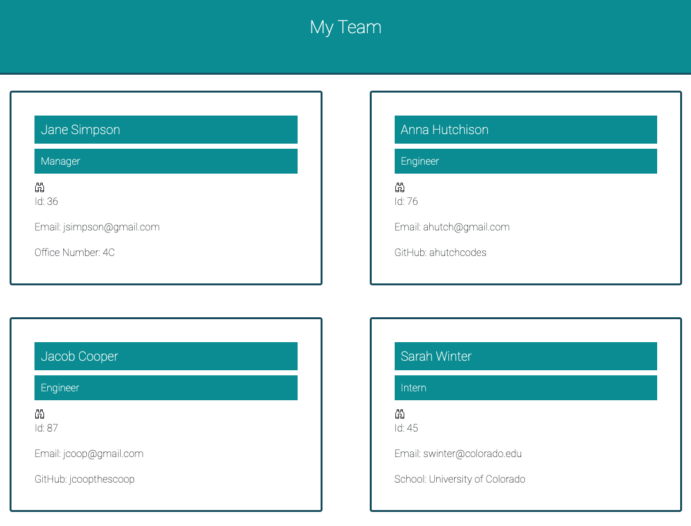

## lets-go-team

* [License](#license)

## License
This project is licensed under the N/A license.
## Description 
This application generates a team profile based on user input from inquirer prompts using node.js. The users answers are generated into a formatted HTML page. 
      
*[Usage](#usage)

*[Installation](#installation)

*[Instructions](#instructions)

*[License](#license)

*[Contributors](#contributors)

## Visual

## Usage 
As a manager I want to generate a webpage that dispalys my teams basic info so that I can have quick access to their emails and gitHub propfiles. 
# Installation
true
## Instructions
To install this project the user will clone the repository, download and install node and then install inquirer. The application is ran in the users terminal.
## License
N/A
## Contributors 
Bridget Schaefer 

# Contact
* GitHub :bridgetvon
* E-mail :bridget.schaefer31@gmail.com